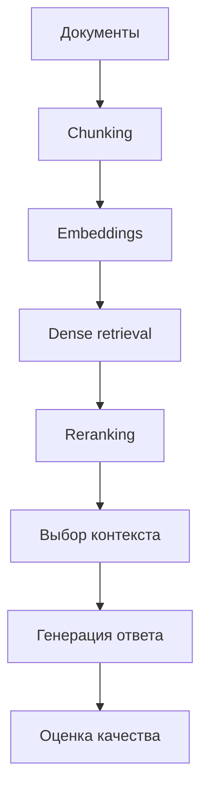

# FinQA RAG Assistant

## Кратко
RAG-пайплайн для ответов на вопросы по финансовым документам: подготовка корпуса, retrieval, reranking и генерация ответа с опорой на найденный контекст.

## Задача
Снизить риск недостоверных ответов в доменно-специфической задаче question answering за счёт поиска релевантных фрагментов и генерации только на их основе.

## Что улучшено
- retrieval + reranking повышают качество контекста по сравнению с retrieval-only baseline;
- генерация опирается на найденные фрагменты, что делает ответы более проверяемыми;
- пайплайн разделён на независимые модули, что упрощает сравнение конфигураций.

## Архитектура


## Метрики и результаты
| Режим | HitRate@K / Recall@K | MRR | Ответ с опорой на контекст | latency |
|---|---:|---:|---:|---:|
| retrieval-only | TBD | TBD | TBD | TBD |
| retrieval + reranking | TBD | TBD | TBD | TBD |
| retrieval + reranking + generation | TBD | TBD | TBD | TBD |

Если результаты уже есть в `baseline.py` или отчётах — подставить реальные значения и коротко сформулировать главный вывод.

## Структура репозитория
- `src/` — загрузка данных, embeddings, retrieval, reranking, generation, pipeline;
- `data/` — исходные и/или подготовленные данные;
- `examples/` — примеры запросов;
- `tests/` — тесты ключевых модулей;
- `baseline.py` — контрольный baseline для сравнения.

## Запуск
```bash
python -m venv .venv
source .venv/bin/activate
pip install -r requirements.txt
python baseline.py
python -m src.pipeline
```

## Ограничения
- качество зависит от схемы chunking и полноты корпуса;
- без ручной оценки нельзя полностью покрыть качество финального ответа;
- доменная специфика корпуса ограничивает переносимость на другие коллекции документов.

## Направления развития
- добавить явную ручную оценку answer faithfulness;
- расширить протокол оценки для нескольких типов вопросов;
- добавить трассировку ошибок: retrieval miss, reranking error, generation drift;
- сделать отдельный режим без генерации для retrieval-only сценариев.
